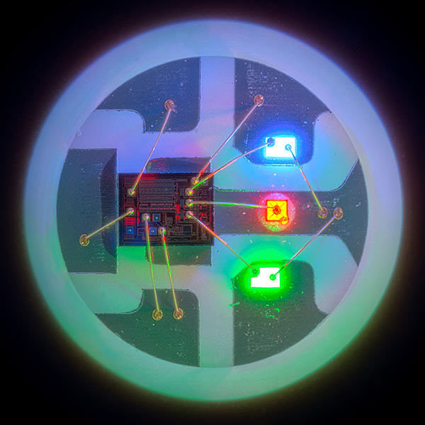

<h1>Adafruit Circuit Playground Express Workshop</h1>

---

- [What is the Adafruit Circuit Playground Express?](#what-is-the-adafruit-circuit-playground-express)
  - [Arduino?](#arduino)
- [Setup](#setup)
- [Workshop](#workshop)
  - [0. Hello World](#0-hello-world)
  - [1. Blinky Blink](#1-blinky-blink)
  - [2. NeoPixels](#2-neopixels)
  - [3. Let there be Sound](#3-let-there-be-sound)
  - [4. Capacitive Touch](#4-capacitive-touch)
    - [4.1 Capacitive Touch Instrument](#41-capacitive-touch-instrument)
  - [5. Light Sensor](#5-light-sensor)
  - [6. Sound Sensor](#6-sound-sensor)
  - [7. Accelerometer (Motion Sensor)](#7-accelerometer-motion-sensor)
  - [8. Temperature Sensor](#8-temperature-sensor)
  - [9. Buttons and Slide Switch](#9-buttons-and-slide-switch)
- [Further examples](#further-examples)
- [Function reference](#function-reference)
- [Glossary](#glossary)
- [Thanks](#thanks)

---

# What is the Adafruit Circuit Playground Express?

It's a microcrontroller that can run code and has these features:

* 10 x mini NeoPixels, each one can display any color
* 1 x Motion sensor (LIS3DH triple-axis accelerometer with tap detection, free-fall detection)
* 1 x Temperature sensor (thermistor)
* 1 x Light sensor (phototransistor). Can also act as a color sensor and pulse sensor.
* 1 x Sound sensor (MEMS microphone)
* 1 x Mini speaker with class D amplifier (7.5mm magnetic speaker/buzzer)
* 2 x Push buttons, labeled A and B
* 1 x Slide switch
* Infrared receiver and transmitter - can receive and transmit any remote control codes, as well as send messages between Circuit Playground Expresses. Can also act as a proximity sensor.
* 8 x alligator-clip friendly input/output pins
* Includes I2C, UART, 8 pins that can do analog inputs, multiple PWM output
* 7 pads can act as capacitive touch inputs and the 1 remaining is a true analog output
* Green "ON" LED so you know its powered
* Red "#13" LED for basic blinking
* Reset button
* ATSAMD21 ARM Cortex M0 Processor, running at 3.3V and 48MHz
* 2 MB of SPI Flash storage, used primarily with CircuitPython to store code and libraries.
* MicroUSB port for programming and debugging
* USB port can act like serial port, keyboard, mouse, joystick or MIDI!

[More information](https://learn.adafruit.com/adafruit-circuit-playground-express) and a [Guided Tour](https://learn.adafruit.com/adafruit-circuit-playground-express/guided-tour)

## Arduino?

<blockquote>

Arduino is an open-source electronics platform based on easy-to-use hardware and software. <a class="wikilink" href="https://www.arduino.cc/en/Main/Products">Arduino boards</a> are able to read inputs - light on a sensor, a finger on a button, or a Twitter message - and turn it into an output - activating a motor, turning on an LED, publishing something online. You can tell your board what to do by sending a set of instructions to the microcontroller on the board. To do so you use the <a class="wikilink" href="https://www.arduino.cc/en/Reference/HomePage">Arduino programming language</a> (based on <a class="urllink" href="http://wiring.org.co/" target="_blank">Wiring</a>), and <a class="wikilink" href="https://www.arduino.cc/en/Main/Software">the Arduino Software (IDE)</a>, based on <a class="urllink" href="https://processing.org/" target="_blank">Processing</a>.

> <a href="https://www.arduino.cc/en/Guide/Introduction">https://www.arduino.cc/en/Guide/Introduction</a>

</blockquote>

# Setup

* Clone or download this repo
* [Download the Arduino IDE](https://www.arduino.cc/en/software) and install it
* Start the Arduino IDE, on Mac it's just called `Arduino`
* [Install "Arduino SAMD boards"](https://learn.adafruit.com/adafruit-circuit-playground-express/set-up-arduino-ide#install-samd-support-2921100) (this is needed as the CPX has a AT<b>SAMD</b>21 chip and the Arduino IDE can't interact with it if the "driver" is not installed)
  * `Tools > Board > Board Manager`
  * Search for `Arduino SAMD boards`
  * Install the boards
* [Install "Adafruit Circuit Playground"](https://learn.adafruit.com/introducing-circuit-playground/circuit-playground-library) library
  * `Tools > Manage Libraries`
  * Search for `Adafruit Circuit Playground`
  * Install the lib, when asked to install dependencies, answer with `Install All`
* Restart the Arduino IDE by quitting it and starting it again, because there are sometimes problems when installing boards and libs. And this solves all the problems :D
* Connect the CPX to your computer
* Select the board in the Arduino IDE
  * `Tools > Board > Arduino SAMD (32-bits ARM Cortex-M0+) Boards > Adafruit Circuit Playground Express`
* Select the USB port on which the CPX is connected to your computer
  * `Tools > Port > /dev/cu.usbmodem101 (Adafruit Circuit Playground Express)`
    * Please note: The name of the port various from computer to computer, so it might be that this is name differently for you

# Workshop

## 0. Hello World

Lets get some text output from the CPX to your computer!

* Open the `Hello World`-sketch (either by loading it in the Arduino IDE or by double-clicking the [0_HelloWorld.ino](sketches/0_HelloWorld/0_HelloWorld.ino) file)
  * This will open the sketch in the Arduino IDE
* Upload the sketch to the CPX
  * In the top left there is a button with an arrow that points to the right, click on this to upload the sketch
  * In the bottom you see a console that shows the status of the upload and if there are any errors
* Open the Serial Monitor to see the messages that the sketch is sending to your computer
  * `Tools > Serial Monitor`
* Reupload the sketch to actually also see the `Started up!` message

## 1. Blinky Blink

In order to see something on the CPX itself, we want to light up some of the standard LEDs that you can find on nearly every microcontroller. 

* Open the [1_Blinky_Blink.ino](sketches/1_Blinky_Blink/1_Blinky_Blink.ino)-sketch
* Upload it to the CPX
* Look at the board, you will see the red LED (D13) is blinking

## 2. NeoPixels

To get even more colorful and use the full potential of the CPX, we will light up all the 10 NeoPixels (an LED that can display any RGB color and each of them can be controlled individually). 

* Open the [2_NeoPixels.ino](sketches/2_NeoPixels/2_NeoPixels.ino)-sketch
* Upload it to the CPX
* Look at the board, you will see all 10 NeoPixel light up with different colors

## 3. Let there be Sound

The CPX has a speaker and we can use that to create sound!

* Open the [3_Let_there_be_Sound](sketches/3_Let_there_be_Sound/3_Let_there_be_Sound.ino)-sketch
* Upload it to the CPX
* You will hear a tone that is played every 1000 ms

## 4. Capacitive Touch

7 of the pads with the label A1 to A7 have capacitive touch, so when you put your finger on them, we will receive a high value and if there is no touch, we will receive a low value. 

* Open the [4_CapacitiveTouch.ino](sketches/4_CapacitiveTouch/4_CapacitiveTouch.ino)-sketch
* Upload it to the CPX
* Open the `Serial Monitor`
* Touch the pad labeled with `A1` with your finger and see that the value is changing

### 4.1 Capacitive Touch Instrument

In order to have a nice boiler plate on how to use all of the 7 pads as an instrument, we can use the [4_CapacitiveTouch_Instrument.ino](sketches/4_CapacitiveTouch_Instrument/4_CapacitiveTouch_Instrument.ino)-sketch

* Upload it to the CPX
* Open the `Serial Monitor`
* Touch sany of the pads from `A1` to `A7` and hear the different sounds that are created

## 5. Light Sensor

This sensor can be used to detect how light or dark the area around the CPX is. You can find it on the board when looking for the `eye` icon, labeled as `A8`. 

* Open the [5_LightSensor.ino](sketches/5_LightSensor/5_LightSensor.ino)-sketch
* Upload it to the CPX
* Open the `Serial Monitor`
* Put your finger on the light sensor to see that the value is decreasing and remove your finger to see that the value is increasing

## 6. Sound Sensor

The CPX has a microphone that can record sound and you can find it near the `ear` icon. 

* Open the [6_SoundSensor.ino](sketches/6_SoundSensor/6_SoundSensor.ino)-sketch
* Upload it to the CPX
* Open the `Serial Monitor`
* Make some noise and see that the value is increasing

## 7. Accelerometer (Motion Sensor)

A sensor that can sense tilt, gravity, motion and 'tap' effects, which sits in the center of the CPX next to the `Y Z X` label. 

> You can ask the sensor for the amount of g detected in X, Y and Z directions. Positive values mean acceleration in the direction of the arrow on the silkscreen. For X that means towards the USB jack. For Y that is to the left. For Z that is straight up pointing towards you when looking at the circuit board.

> https://learn.adafruit.com/circuit-playground-lesson-number-0/accelerometer

* Open the [7_Accelerometer.ino](sketches/7_Accelerometer/7_Accelerometer.ino)-sketch
* Upload it to the CPX
* Open the `Serial Monitor`
* Move the CPX around and see the values are changing

## 8. Temperature Sensor

Right next to the ATSAMD21 you can find the temperature sensor, marked with a `temperature` icon, labeled with `A9`. 

* Open the [8_TemperatureSensor.ino](sketches/8_TemperatureSensor/8_TemperatureSensor.ino)-sketch
* Upload it to the CPX
* Open the `Serial Monitor`
* Put your finger ontop of the sensor and see that the value is increasing. Remove your finger and see that the temperature is decreasing

## 9. Buttons and Slide Switch

You want some "proper" hardware to trigger certain actions on the CPX? Then the two buttons and the slide switch are the best option for your needs. 

* Open the [9_Buttons_and_SlideSwitch.ino](sketches/9_Buttons_and_SlideSwitch/9_Buttons_and_SlideSwitch.ino)-sketch
* Upload it to the CPX
* Push the left button and see that the red LED is turned on
* Push the right button and hear a tone
* Use the slide switch to turn on / off a random NeoPixel animation

# Further examples

* Advanced usage of the SoundSensor combined with logging: [10_SoundSensor_logging](sketches/10_SoundSensor_logging) (thanks to @gaganis for adding this)
* You can find even more ready-to-run [examples from Adafruit](https://github.com/adafruit/Adafruit_CircuitPlayground/tree/master/examples)! 
* [Simon Game](https://learn.adafruit.com/circuit-playground-simple-simon/playing-the-game)

# Function reference

You can find all possible functions for the `Adafruit_CircuitPlayground`-library by looking at [Adafruit_Circuit_Playground.h](https://github.com/adafruit/Adafruit_CircuitPlayground/blob/master/Adafruit_Circuit_Playground.h)

# Glossary

* CPX: Circuit Playground Express
* Sketch: An Arduino IDE program that can be uploaded to the CPX and then runs on it when ever the CPX is connected to a power source

# Thanks

* A big thanks to https://github.com/mirabellej for their [open-source workshop material](https://github.com/mirabellej/Codame/) that heavly inspired this workshop
* A super big thanks to [Synoa](https://synoa.de) for giving me the time to prepare the workshop for our team
